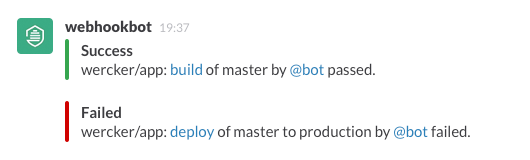

[](https://app.wercker.com/project/bykey/0b1b7eab6c9b56e23f5903c2b5ac708a)

# slack-notify

Send a message to a [Slack Channel](https://slack.com/).



## Getting started

Required

* `token` - Your Slack token.
* `channel` - The channel name of the Slack Channel (without the #).
* `subdomain` - The slack subdomain.
* `username` - The bot username.
* `icon_url` | `icon_emoji` - The icon to use for this bot.

You can create a slack token by going to the account page on your slack domain:
`<your-subdomain>.slack.com/services` and click 'add New Integration' and select
'incoming webhooks'. Copy your token (as can be found in the example curl
command) and don't forget to click 'Add Integration'.

This token can be used directly in the wercker.yml (not
recommended) or better: as an environment variable. You can add environment
variables to wercker, by going to the settings tab of your application.
In the `pipeline` section you can add environment variables. You can use
those environment variables in the [wercker.yml](http://devcenter.wercker.com/articles/werckeryml/)
just as you would normally in a shell script (with a dollar sign in front of it).

### Example

Add `SLACK_TOKEN` as deploy target or application environment variable.

```yaml
build:
    after-steps:
        - sherzberg/slack-notify:
            subdomain: slacksubdomain
            token: $SLACK_TOKEN
            channel: general
            username: wercker
            icon_url: https://avatars3.githubusercontent.com/u/1695193?s=140
```

## Develop

Install gems and stab environtment

```bash
$ bundle
$ cp .env.example .env
$ vi .env
```

Run notification

```bash
$ dotenv ./run.sh
```

## CHANGELOG

### 0.0.9
- Implement rich notification

### 0.0.8
- added custom icon url, icon emoji, and username properties

### 0.0.6
- Deploy url added
- the build/deploy words are now used as links instead of showing the full
url
- Show the branch name in the deploy message

### 0.0.5
- Minor change in documentation

### 0.0.4
- updated documentation
- check for redundant hash in channel argument
- tests added

## License

The MIT License (MIT)

Copyright (c) 2013 wercker

Permission is hereby granted, free of charge, to any person obtaining a copy of
this software and associated documentation files (the "Software"), to deal in
the Software without restriction, including without limitation the rights to
use, copy, modify, merge, publish, distribute, sublicense, and/or sell copies of
the Software, and to permit persons to whom the Software is furnished to do so,
subject to the following conditions:

The above copyright notice and this permission notice shall be included in all
copies or substantial portions of the Software.

THE SOFTWARE IS PROVIDED "AS IS", WITHOUT WARRANTY OF ANY KIND, EXPRESS OR
IMPLIED, INCLUDING BUT NOT LIMITED TO THE WARRANTIES OF MERCHANTABILITY, FITNESS
FOR A PARTICULAR PURPOSE AND NONINFRINGEMENT. IN NO EVENT SHALL THE AUTHORS OR
COPYRIGHT HOLDERS BE LIABLE FOR ANY CLAIM, DAMAGES OR OTHER LIABILITY, WHETHER
IN AN ACTION OF CONTRACT, TORT OR OTHERWISE, ARISING FROM, OUT OF OR IN
CONNECTION WITH THE SOFTWARE OR THE USE OR OTHER DEALINGS IN THE SOFTWARE.


